# RichsSnackRack
This Project is a .Net sandbox for testing new technologies, design principles, paradigms, packages etc. asl well as documenting any challenges along the way.

# Functional Programming
For reference as a personal goal this project will also be an attempt to learn functional programming so as much as possible functional programming principles will be used at least up to my understanding of the concepts.

# Challenges
## Adding Docker Support For MySql

The ability to add Docker support for any .net core project to start with is pretty straight for to start because both Visual Studio and Studio for Mac have convient add Docker Support buttons which will default add docker.

However what is a struggle is any time you need to adjust the Yaml file for docker compose. I'm not awful at using VS For Mac for that so I gave it a shot. I based a lot of wha I need from here [Adding MySQL to ASP.NET Core App With Docker Compose](https://code-maze.com/mysql-aspnetcore-docker-compose/), here [How to Create a MySql Instance with Docker Compose](https://medium.com/@chrischuck35/how-to-create-a-mysql-instance-with-docker-compose-1598f3cc1bee)

My first attempt at building the compose from VS for Mac came out like this.
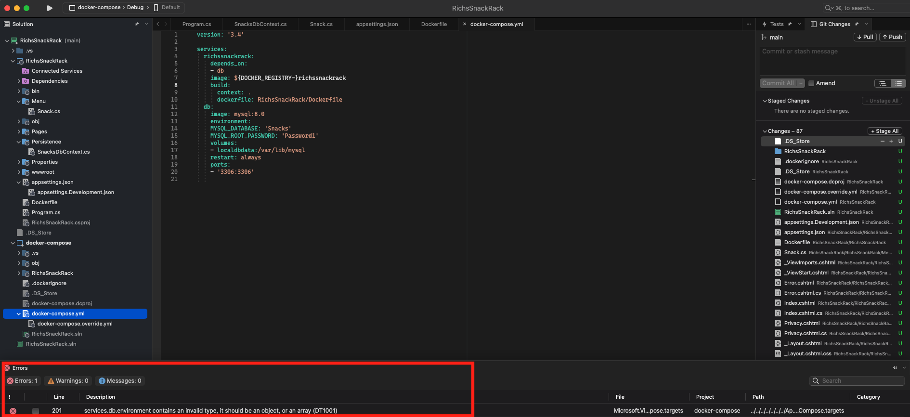

I took a guess that I formatted things in correctly so I opened VS Code which can have a number of extensions installed to correctly format Yaml and help me find the problem because format is most likely the problem with Yaml.
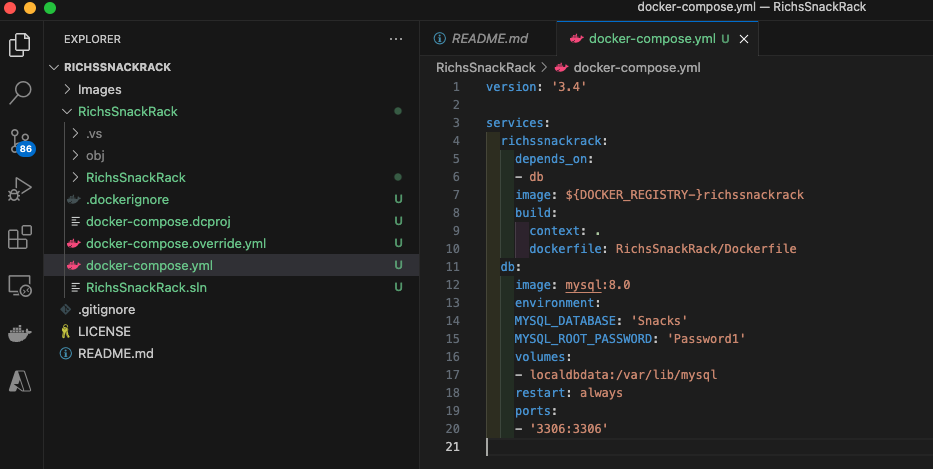

After checking the articles I realized that since the environment variables are arrays I just had them misplaced and they needed to moved over. After that however I ran into a different problem with volumes.

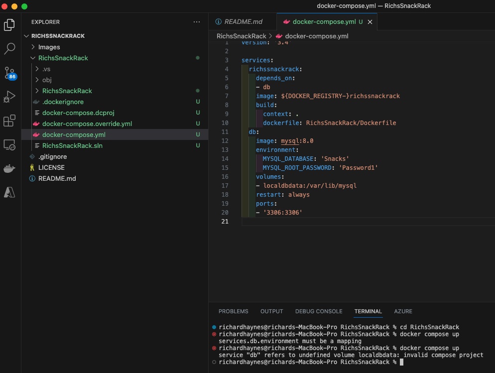

Ok after adding the Volumes here is what the final Docker file looked in both VS Code and VS For Mac

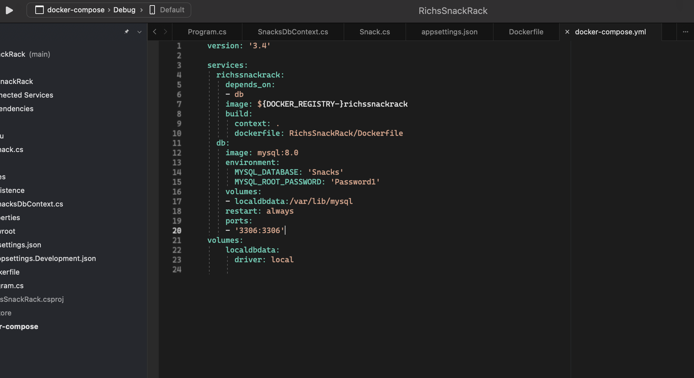

So after all these changes I tried another Docker compose again now this time I got this error but after letting everything stopped I realized the web app spun up before the docker container was fully ready

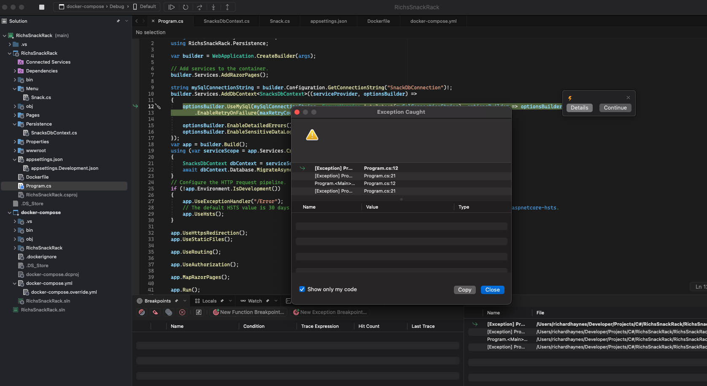

And after all of that 
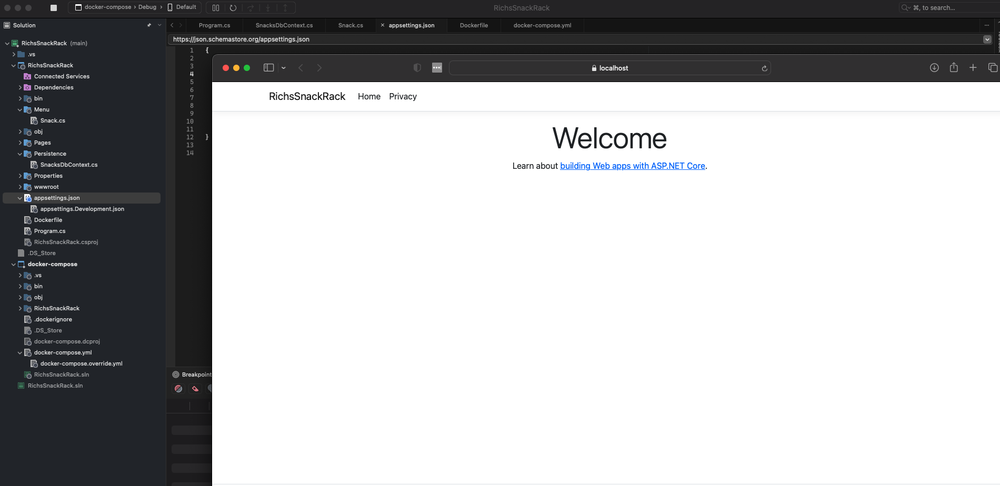

## Creating New Migrations

After the the initial migrations for the Ef history table where created my next step was to contain a migrations for the Snack's table and then another to insert data. However I ran into a few issues in just applying the migrations.

I was getting circular depedency errors from the docker compose file when trying to execute the " dotnet ef migrations add ".

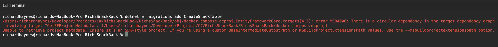

I tried to specify the project name but that wasn't succesful either.
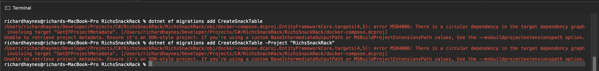

 After reading this article [Applying Entity Framework Migrations to a Docker Container](https://codebuckets.com/2020/08/14/applying-entity-framework-migrations-to-a-docker-container/) I realized that I needed to do a docker compose then try the migrations.

 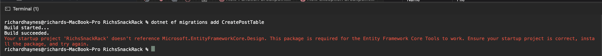

 Since the next error stated I still needed to add the Design nuget I went to the nuget packages manager to add it.
 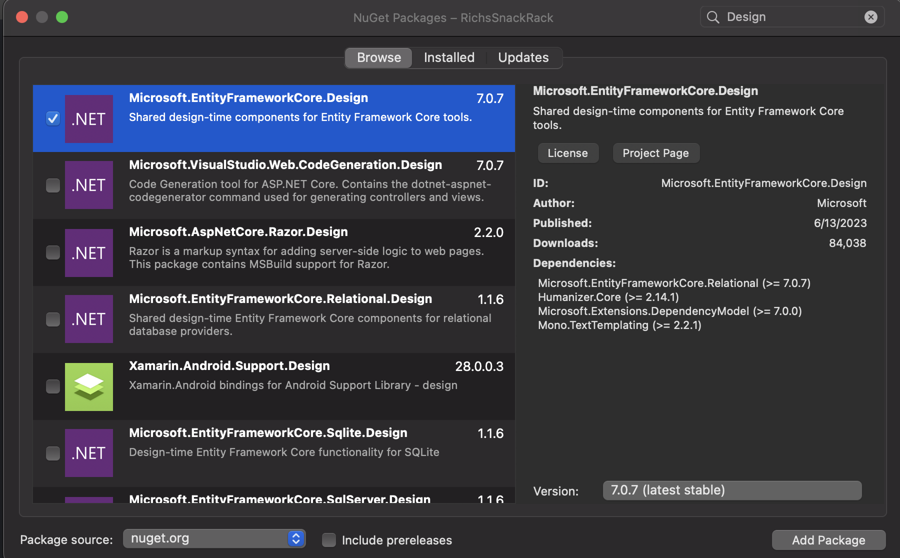

 Now the MySQL Hosts appear to be not be being detected from the connection strings
 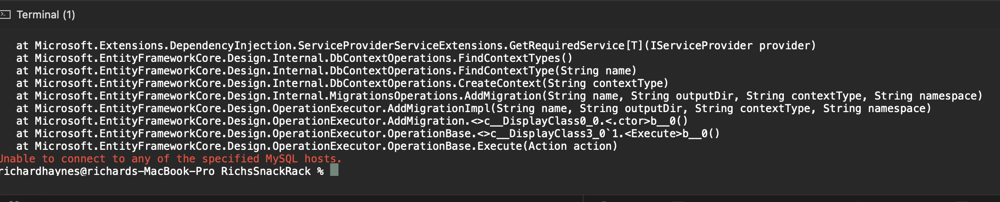

 Just to rule it out I used TablePlus to connect to the docker database to confirm even the 127.0.0.1 ipaddress host should work.
 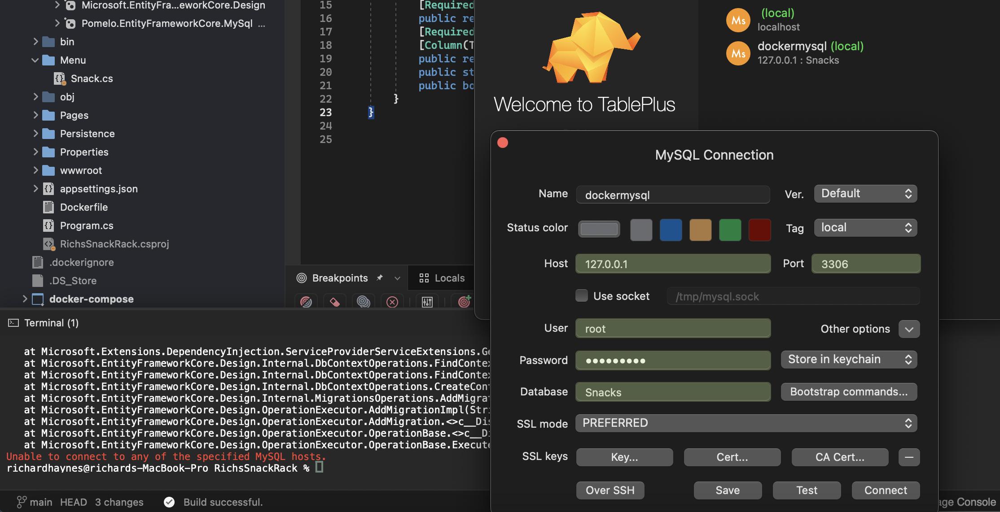

 After doing a lot googling I couldn't find anything that was a few simple steps that would allow me to make the migrations work. So I decided to work around the problem and shut down the container and reconnected to my local instance of MySql and that worked for my needs but since it's a workaround eventually I need to find a way to generate the migrations from my docker container.

 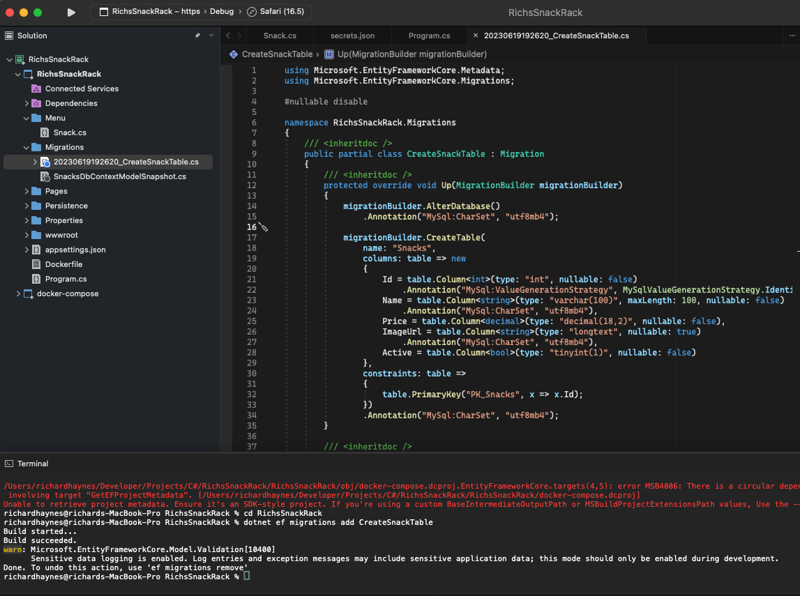

 I next decided that since I was connected to my local to test my inserst statement there and found that the Active flag I created for some reason didn't get a default value and I missed that during the migration. 
 
 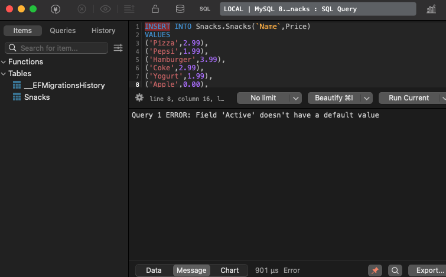
 
 I believe it's because MySql doesn't have the concept of a bool so it uses a tinyint(1) in place of a bool for true or false.

 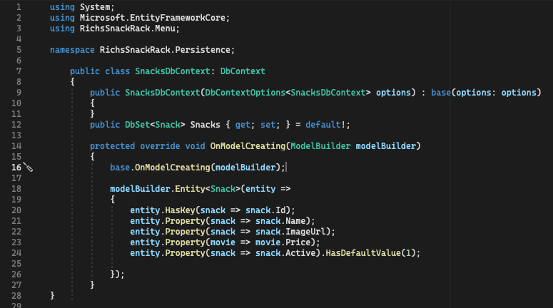
 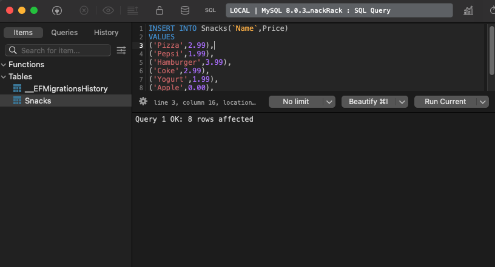

## Creating New Migrations Part 2

Ok I knew it would happen that I'd need to find some solution to the migrations not working for the container. I was getting ready to build a new Order model.

After doing some more searching I found this github issue [dotnet ef migrations add <name> fails in docker container #291](https://github.com/PomeloFoundation/Pomelo.EntityFrameworkCore.MySql/issues/291) , that showed how I could configure the container environment variable to allow the container to apply changes.

1st. I configured the docker_compose file.

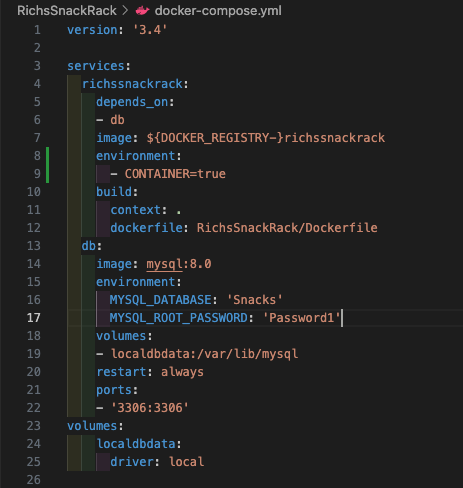

2nd. Update the connection string to change base of the environment variable in the docker_compose.

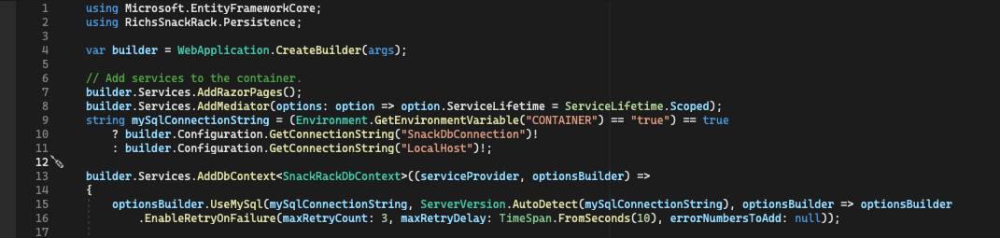

3rd. Update the connection strings in the Appsettings. (My actual values are in secrets)
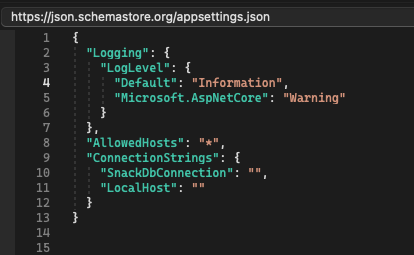

4th. Create Order Table migrations where created after that.
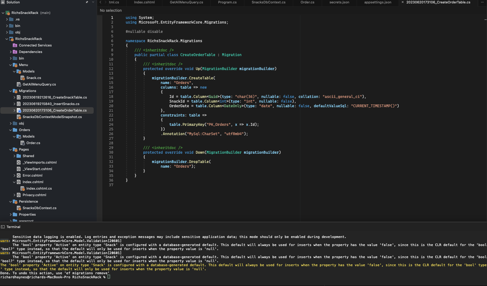

## Default Value Incorrect

Turned out the migration lacked the correct ability to add a default value.

This stack overflow showed a data annotation to correct the problem however [Setting the default value of a DateTime Property to DateTime.Now inside the System.ComponentModel Default Value Attrbute](https://stackoverflow.com/questions/691035/setting-the-default-value-of-a-datetime-property-to-datetime-now-inside-the-syst)

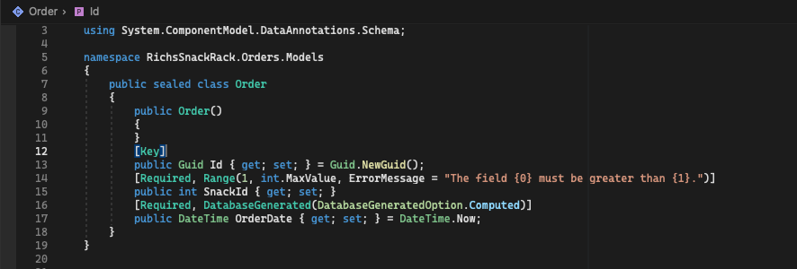
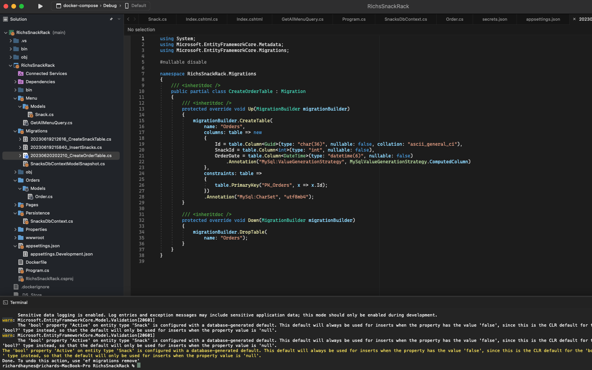